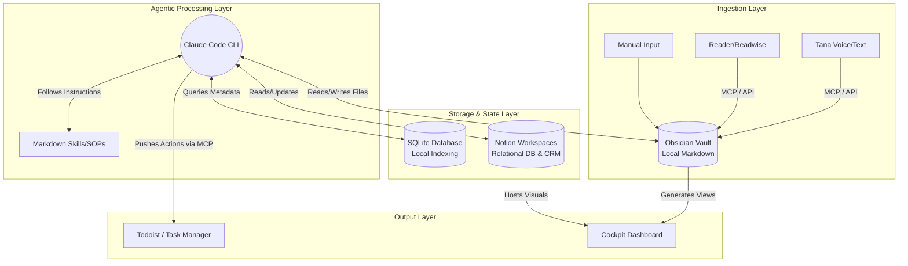

# System Architecture & Design Document: AI-Powered Local Second Brain

## 1. Introduction
This Design Document outlines the architectural approach for the AI-Powered Local Second Brain. The system leverages local Markdown files via Obsidian, structured tracking via Notion and SQLite, and the cognitive reasoning power of Claude Code CLI equipped with MCP (Model Context Protocol) servers.

## 2. High-Level Architecture

The architecture is divided into three primary layers: Storage & State, Agentic Processing, and Ingestion/Integration.



## 3. Component Design

### 3.1 Data Storage & State Management
1. **Obsidian Vault (Local Markdown):**
   * Acts as the primary source of truth.
   * Stores Daily Notes, Concept Notes, Meeting Transcripts, and the core link graph.
   * Benefits: Maximum privacy, interoperability, robust bidirectional linking.
2. **SQLite Database:**
   * Used as a high-speed indexing layer.
   * While Obsidian holds the raw text, SQLite logs vector summaries, interaction timestamps, UI state metrics, and thousands of micro-journal entries for rapid SQL querying by the AI.
   * Managed manually if needed via TablePlus.
3. **Notion:**
   * Acts as the "Cockpit" UI and structured relational backend for entities that require rich views (e.g., Kanban boards, CRM pipelines, structured Project tracking).
   * Claude Code interacts with Notion via the Notion API / MCP Server to sync states extracted from the unstructured Obsidian vault.

### 3.2 Agentic Processing Layer (Claude Code)
* **Core Loop:** Claude Code runs within the terminal directory of the Obsidian vault. It acts as a persistent CLI agent.
* **Memory & Context:** Uses the `/context load` command to pull daily notes, project states, and recent SQLite entries into its working memory before session start.
* **Skill Execution:** Standard Operating Procedures (SOPs) are defined as `.md` files (e.g., `Skill_CRM_Processor.md`). Claude Code references these files when asked to process specific inputs.

### 3.3 Integration Layer (MCP Servers)
Model Context Protocol servers run locally to give Claude Code tools to interact with the outside world:
* **Tana MCP:** Pulls raw capture and transcripts.
* **Notion MCP:** Reads databases to check project status; writes updates.
* **Todoist MCP:** Dispatches action items extracted from journal entries.
* **SQLite MCP:** Executes SQL commands generated by Claude to lookup vault statistics or write summary index data.

## 4. Key Workflows & Data Models

### 4.1 The ICOR Data Model
Data is conceptually mapped standardly across Obsidian, Notion, and SQLite:
* `Dimension` -> `Key_Element` -> `Goal` -> `Project/Habit`
* **Metadata schema for files:**
  ```yaml
  ---
  id: 12345
  type: concept | journal | meeting
  icor_element: [Key_Element_Name]
  attention_score: 85
  ---
  ```

### 4.2 Daily Intake Flow
1. User logs a random thought in a Daily Note (Obsidian).
2. End of day context run (`/close day` command in Claude Code).
3. Claude parses the Daily Note.
4. If an action is found -> Trigger Todoist MCP.
5. If a meeting is found -> Extract details, push to Notion CRM, write a linked summary in Obsidian.
6. If a new concept is found -> Prompt user to `/graduate` it to a concept file.

### 4.3 Pattern Detection Flow
1. User invokes `/drift`.
2. Claude queries SQLite for the past 30 days of journal entries.
3. Claude pulls the stated "Goals" from Notion.
4. Claude compares the semantic focus of the journal entries against the stated goals to calculate alignment vs. "drift."
5. Output is appended to the Daily Note.

## 5. Security and Privacy Considerations
* **Local-First:** The primary raw text and deep thoughts stay in the local Obsidian vault.
* **API Key Management:** API keys for Notion, Todoist, and Claude are stored securely in local `.env` files.
* **Selective Syncing:** The AI is instructed via its System Prompts to never upload raw journal entries to public LLM training endpoints (reliant on Anthropic's API privacy policies).
